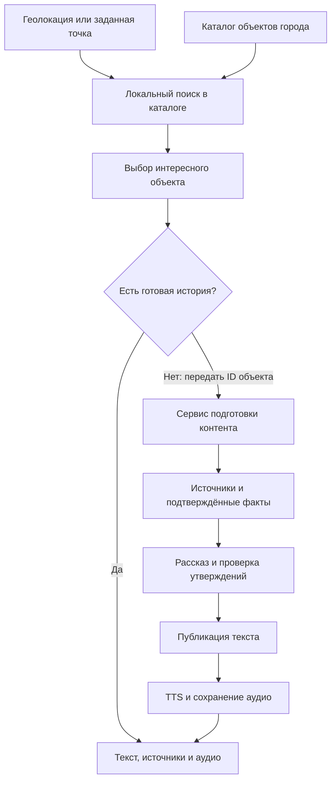

# План: найти место рядом, подготовить рассказ и озвучить

Дата: 2026-09-05. Статус: предложение к реализации.

Стартовое допущение: Москва, русский язык, пилот в районе существующего маршрута. Затем расширение каталога на другие районы и города. Пользователь задаёт центр поиска через геолокацию, координаты или точку на карте. Радиус выбирается из 100, 200 и 300 метров; по умолчанию 200 метров. Это круг от центра, а не кольцо с минимальным расстоянием 100 метров.

## 1. Что уже есть в проекте

- Браузерная геолокация и replay для воспроизводимой проверки.
- Расчёт расстояний и геотриггер с фильтрацией неточных фиксов.
- Один аудиоэлемент, обработка ограничений запуска звука, офлайн-кэш.
- Тип `Poi` с координатами, точкой осмотра, фактами, источниками и `audio_url`.
- Статический маршрут с одним тестовым объектом; интерфейс использует `route.pois[0]`.

Нет общего каталога, поиска соседних объектов, полного текста истории, загрузчика источников, генератора текста и TTS-пайплайна. Приложение экспортируется в `out/`, серверного рантайма нет. Локальное руководство установленного Next.js подтверждает, что обработчики динамических запросов и Server Actions несовместимы с текущим статическим экспортом.

## 2. Архитектурное решение

Сохранить статический клиент. Загружать компактный каталог выбранного города или пилотной территории и искать ближайшие объекты в браузере. Сбор источников, LLM и TTS выполняет отдельный сервис подготовки контента. В первом прототипе его можно запускать вручную как скрипт; генерация по запросу потребует постоянно доступных API и worker.

Схема:

Точные координаты пользователя и введённый центр не передавать на сервер или в сторонние POI API. Сервер получает ID места и настройки истории. Такой ID всё равно раскрывает интерес к конкретному месту: это не полная анонимность. Не сохранять историю перемещений. Для пилота использовать общий пакет территории; внешние карты могут раскрывать область просмотра через запросы тайлов, поэтому предпочтителен заранее подготовленный пакет карты. Геокодирование адреса добавить отдельно с понятным описанием передачи адреса провайдеру.

Ограничение: локальный поиск работает только в загруженном покрытии. Если город ещё не импортирован, показывать отсутствие покрытия; не выдавать это за отсутствие достопримечательностей. Произвольный мировой поиск с передачей координат провайдеру был бы отдельным изменением текущего продуктового требования приватности.

## 3. Поиск и выбор интересного места

1. Получить центр: браузерная геолокация после действия пользователя, ввод `lat/lon` или постановка точки на карте. Ручной выбор работает без доступа к GPS.
2. Проверить диапазоны координат, свежесть GPS и его точность. Начальный порог точности — 50 метров, с уточнением после полевой проверки. При плохом сигнале показать погрешность и предложить ручную точку; не утверждать уверенно, что объект попал внутрь радиуса.
3. Отобрать каталог по ограничивающему прямоугольнику, затем точно проверить расстояние. Использовать имеющийся расчёт расстояний. Радиус считать по прямой до проверенной точки осмотра, а при её отсутствии — до координаты объекта. Расстояние не равно длине пешего пути.
4. Искать здания с историей, памятники, мемориальные доски, инженерные сооружения, сады, музеи, места исторических событий. Удалять дубли по внешним ID, адресу и геометрии; учитывать, что одна усадьба может иметь несколько записей.
5. Отделить наличие POI от наличия материала для рассказа. Без достаточных источников объект может остаться в каталоге, но не получать статус готовой истории.
6. Ранжировать по качеству источников, содержательности фактов, видимым деталям, возможности осмотра, расстоянию и тому, слушал ли пользователь рассказ. В MVP использовать прозрачные правила; близость не должна перевешивать отсутствие истории.
7. Предложить одно лучшее место и до двух альтернатив с коротким объяснением выбора. После загрузки фактов повторно оценить кандидата; если материала мало, перейти к следующему.
8. Если в выбранном радиусе нет подходящего места, предложить увеличение до 300 метров или другую точку. За выбранную границу молча не выходить. Закрытые территории и препятствия учитывать отдельно; доступность осмотра первоначально проверять редактором.

Каталог собирать заранее из OpenStreetMap, Wikidata, геопривязанных статей Wikipedia и проверенных городских источников. Overpass поддерживает поиск `around` с расстоянием в метрах; MediaWiki Geosearch возвращает близлежащие геопривязанные статьи. Ни один источник не гарантирует полноты покрытия. Публичные Overpass-инстансы использовать для ограниченного импорта с кэшем, а не вызывать на каждый GPS-фикс. Источники: [Overpass QL](https://wiki.openstreetmap.org/wiki/Overpass_API/Overpass_QL), [Overpass API](https://wiki.openstreetmap.org/wiki/Overpass_API), [MediaWiki Geosearch](https://www.mediawiki.org/wiki/API:Geosearch).

## 4. Загрузка истории и проверка фактов

Для каждого объекта собрать карточку идентичности: официальное название, исторические названия, адрес, координаты и внешние ID. Сначала искать по связанным идентификаторам и известным ссылкам, затем по сочетанию названия и адреса. Проверять, что текст относится к тому же зданию, а не к одноимённой организации или прежнему адресу.

Приоритет источников: музей или архив, официальный городской ресурс, реестр наследия, профильное исследование; Wikipedia использовать как дополнительный вход и указатель на литературу. В Москве проверить применимость «Узнай Москву». При проверке существующая ссылка проекта вернула 403, поэтому доступность автоматического импорта с этого сайта пока не подтверждена. При недоступности брать другой разрешённый источник или редакторскую выжимку с атрибуцией.

Сохранять по каждому факту:

- Само утверждение и идентификатор объекта.
- URL, название источника, дату доступа и версию материала, если доступна.
- Короткий подтверждающий фрагмент и место в документе.
- Статус: подтверждён, спорен, легенда, не подтверждён; основание присвоения статуса.

Для полноценного рассказа ориентир — 3–5 содержательных фактов; для бедного материала допустима короткая заметка. Желательны два независимых источника; один сильный первичный источник допустим, если он подтверждает все используемые утверждения. Две перепечатки не считать независимым подтверждением. Противоречащие даты и авторство отправлять на проверку; не выбирать версию только по числу совпадений.

Проверять условия использования материалов, сохранять атрибуцию и сведения о лицензии. Тексты страниц считать недоверенными данными, исключить исполнение инструкций из них. Загрузчику разрешать только проверенные публичные адреса, проверять перенаправления, ограничивать объём и время скачивания.

## 5. Генерация интересного рассказа

LLM получает карточку объекта и пакет отобранных фактов с ID источников. История состоит из четырёх частей:

1. Деталь, на которую человек может обратить внимание на месте, если её наличие подтверждено.
2. Человек, событие или изменение, объясняющее, почему это место интересно.
3. Две-три конкретные подробности, связанные в понятный сюжет.
4. Возвращение к тому, что сохранилось и что можно рассмотреть сейчас.

Ориентир: 180–260 слов, примерно 90–120 секунд в зависимости от темпа и пауз. Длительность уточнять по готовому аудио. Избегать лекционного перечисления дат, вымышленных диалогов, мыслей исторических лиц и неподтверждённых сцен. Легенды в первом MVP исключить; позже можно добавить отдельный явно обозначенный формат.

Генерировать `title`, `opening`, `text` и внутреннее соответствие утверждений фактам. Отдельным проходом проверять имена, даты, числа и поддержку каждого исторического утверждения источником. Автоматическая проверка уменьшает риск ошибок, но не заменяет редактора: первые 20–30 историй проходят ручную проверку перед публикацией. Непрошедший текст не отправлять в TTS.

Выбор LLM сделать по пробе на 10 одинаковых пакетах фактов: точность, русский язык, связность, цена, задержка и доступность развёртывания. В интерфейсе показывать полный текст и источники.

## 6. TTS и воспроизведение

Начальный кандидат для русской озвучки — Yandex SpeechKit. Перед выбором голоса прослушать одинаковые тексты с фамилиями, датами и московскими топонимами. Сервис поддерживает управление произношением и паузами; конкретный формат разметки зависит от версии API. Для v3 использовать TTS-разметку: SSML поддерживается только в v1. Источник: [документация синтеза SpeechKit](https://aistudio.yandex.ru/ru/docs/speechkit/tts/).

Хранить читательский текст отдельно от версии для произношения. Подготовить словарь ударений и раскрывать сокращения. Синтезировать только проверенную версию, сохранять аудиофайл и измеренную длительность. Формат выбрать по поддержке провайдера и испытаниям существующего плеера на iOS Safari и Android Chrome; при необходимости нормализовать в MP3 на worker.

Ключ повторного использования аудио: хеш текста для озвучки + провайдер/версия голоса + настройки + версия словаря произношения. Повторный запрос не должен запускать новый платный синтез. При сбое TTS оставить текст доступным и разрешить повтор только стадии озвучки. У готовой истории не использовать тестовый сигнал как подмену недоступного аудио.

Разрешение на звук получать через действие пользователя. Радиус поиска 100–300 метров не смешивать с радиусом автоматического запуска рядом с объектом. Выбор точки на карте позволяет слушать удалённо по кнопке; автоматический запуск в прогулке зависит только от реальной позиции. Готовность новой истории не должна прерывать текущую запись.

## 7. Данные, API и выполнение задач

Разделить сущности: `Place` — объект; `Source` и `Fact` — доказательства; `Story` — версия текста; `AudioAsset` — вариант озвучки; `GenerationJob` — состояние подготовки. Существующий `Poi` использовать через адаптер, сохранив работу маршрута.

Каталог содержит ID, название, категорию, координаты, точку осмотра, краткий признак интереса и состояние контента. История содержит полный текст, ссылки на факты, язык, версию, статус проверки и ссылку на аудио. Не запекать изменяющиеся статусы задач в неизменяемый городской каталог: актуальное состояние получать у сервиса по ID объекта.

Предлагаемые контракты отдельного сервиса:

- `GET /v1/places/{id}/story`: готовый текст/аудио либо явное отсутствие контента.
- `POST /v1/story-jobs`: ID объекта, язык и профиль длины; готовая история либо ID задачи. Координат пользователя в запросе нет.
- `GET /v1/story-jobs/{id}`: стадия подготовки, доступный результат и возможность повтора.

Состояния: `queued → fetching_sources → extracting_facts → drafting → checking → text_ready → synthesizing → ready`. Отдельные исходы: `insufficient_sources`, `review_required`, `failed`. Текст разрешено показывать на `text_ready` после проверки. Для пилота редакторское ожидание явно отражать в статусе; не обещать мгновенную историю, если нужна ручная проверка.

Для начала достаточно одного worker, базы задач и хранилища аудио. Для одного узла допустима SQLite с устойчивым диском; распределённую инфраструктуру выбирать при подтверждённой нагрузке. Добавить уникальный ключ задачи, ограниченные повторы, таймауты, восстановление после перезапуска, лимит стоимости и число задач от клиента. Ключи провайдеров находятся только на сервере. Отмена клиентского ожидания не должна уничтожать общую задачу других слушателей.

Кэшировать отдельно источники, факты, версии историй и аудио. Обновление источника создаёт новую проверяемую версию; текущая опубликованная остаётся доступной. Для нового API настроить проксирование и CSP на текущем сервере размещения. Динамически созданные файлы не попадут автоматически в существующий кэш статической сборки: добавить явное скачивание истории для офлайна, версионирование и ограничение занимаемого места.

## 8. Порядок реализации

| Этап | Работа | Проверяемый результат |
| --- | --- | --- |
| 1. Проверка данных | Выбрать пилотную территорию, собрать 20–30 объектов, проверить источники и внешние ID | Понятно, какие места дают достаточно материала; отмечены пробелы покрытия |
| 2. Поиск | Ручные координаты, GPS, каталог, радиусы, выбор кандидатов | Для заданной точки выдаются подходящие объекты в выбранном радиусе |
| 3. Один полный рассказ | Подготовить источники, факты, текст, ручную проверку и TTS для существующего тестового POI | В приложении читается полный рассказ, открываются источники, играет настоящее аудио |
| 4. Пакет историй | Прогнать тот же процесс для пилотных объектов, проверить редактором | Поиск предлагает несколько готовых историй и осмысленно выбирает лучшую |
| 5. Подготовка по запросу | Добавить API, задачи, worker, повторное использование и статусы | Для объекта без истории запускается одна задача, проверенный текст появляется раньше аудио |
| 6. Полевая проверка | GPS, ручная точка, плохая сеть, iOS/Android, офлайн, стоимость | Основной сценарий устойчив; измерены задержка, качество и цена |

Такой порядок сначала проверяет самый дорогой риск — возможность регулярно получать достоверные и интересные истории. До успешного пилота не вводить векторную БД, сложный агентный оркестратор и генерацию заново для каждого прохожего.

## 9. Критерии готовности

- Одинаковый центр и радиус дают одинаковый набор кандидатов для GPS и ручного ввода; проверены границы 100/200/300 метров.
- Отдельно проверены отказ GPS, устаревшие координаты, плохая точность, отсутствие покрытия и отсутствие интересного объекта.
- В каталоге нет дублей одного объекта; история не подменяет соседнее здание с похожим названием.
- У каждого опубликованного исторического утверждения есть подтверждение; недостаток источников даёт понятный исход без выдуманной истории.
- При одновременном запросе одной версии создаётся одна задача; повтор после ошибки TTS не повторяет сбор фактов и генерацию текста.
- Устаревший ответ после смены точки не переключает выбранное место; готовое аудио не прерывает уже запущенное.
- Кнопки воспроизведения и повтора проверены на реальных iOS/Android; скачанная история доступна без сети.
- Сетевые запросы и логи не содержат пользовательских GPS-координат и трека; ограничения приватности сторонних карт описаны честно.
- Измерены время до кандидатов, текста и аудио, доля успешной подготовки, стоимость новой истории и повторного прослушивания. Целевые задержки установить по пилоту, а не обещать заранее.
- После изменений приложения проходят предусмотренные проектом `lint`, `typecheck`, `test`, `build` и целевые проверки нового поведения.

## 10. Решения после пилота

Выбрать следующие города, конкретную LLM и голос, лимит расходов на одну историю, период обновления источников и долю контента, допустимую к публикации без редактора. Эти решения не блокируют проверку полного сценария на одном районе и одном существующем объекте.

## Доработка плеера, 7 сентября 2026

Пользователь подтвердил запуск аудио в Safari iOS. Следующий этап:
пауза/продолжение, перемотка ±15 секунд и сохранение части/позиции на устройстве.

Делегирование: Airouter `coding-high`, idempotency key
`otgolosok-audio-player-20260907-v1`. Первая попытка через локальный Codex
не создала задание из-за требования подтверждения MCP. После перезапуска
Codex прямое MCP-подключение работает.

- Thread: `06f922ac-cf15-4988-8c7d-34ebee5eda7c`
- Run: `0bcbc184-7d43-40a0-92b5-76907da4ae19`
- Начало: `2026-09-07T10:08:29Z`
- Ответственность: предложение аудиохелперов и регрессионных тестов.
- Статус: завершился ошибкой; результат не принят.

Первый run завершился через 121 с с `model_outcome_unknown`: 0 шагов,
0 зарегистрированных токенов, артефактов нет. Неизвестный результат запроса
модели не считается успешной работой или измеренной стоимостью.

После терминальной ошибки задача сокращена до диффа аудиофункций и 5–8
тестов, выбран профиль `coding`:

- Thread: `b239a266-f970-40c2-aa41-b90c0c70eeb5`
- Run: `3b8b17d5-193a-4cac-9dca-c0ab39f0bdf4`
- Key: `otgolosok-audio-player-20260907-v2`
- Начало: `2026-09-07T10:12:05Z`

Второй run завершился `token_budget_exceeded` в `10:14:40Z`: 154 с работы,
5 шагов, 29 638 зарегистрированных токенов. До ошибки сохранены два
артефакта: `audio-element-proposal.diff` (4100 байт) и
`src/lib/audio/audio-player.test.ts` (3633 байта). Это частичный результат,
а не успешно завершённое удалённое задание.

Приняты после локального ревью: пауза, продолжение без перезагрузки MP3,
перемотка и отменяемое восстановление позиции после metadata; 6 тестов.
Локальная доработка: нормализованы хунки диффа, исправлен lint для таймера,
проверяется `readyState` перед использованием уже доступной длительности,
добавлены 4 регрессии на устаревшую metadata, кэш, выход и таймаут.
Интерфейс, хранение позиции и его 5 тестов реализованы локально.

Проверка: `make check` — lint, TypeScript, 119 тестов и сборка прошли.
Chromium: пауза/продолжение, ±15 секунд, ползунок до конца, возврат после
окончания, смена частей, reload и офлайн-продолжение со второй части на
30-й секунде, сброс через «Начать сначала»/«Закончить маршрут», отмена
зависшего старта. Горизонтального переполнения нет при 320/390/768/1440 px.
Повтор после сетевой ошибки сохраняет 20-ю секунду при отдаче MP3 с Range
от production Nginx. Простой Python preview без Range в этом сценарии
сбрасывает seek; он не подходит для проверки восстановления без SW.
Новые кнопки ещё требуют проверки на физическом iPhone.

Опубликовано через `services deploy-static`: версия `b83b6cc63b500bbf`,
7 сентября 2026, 13:23 MSK. Резервная копия перед публикацией:
`/srv/sites/otgolosok.softmg.tech/backups/before-player-controls-20260907.tar.gz`.
На production проверено обновление со старой офлайн-версии через
`/update.html`, пауза, перемотка и офлайн-reload с продолжением на 15-й
секунде. Ошибок JavaScript нет. Загруженный `sw.js` совпадает со сборкой,
MP3 отдаёт `206`, `robots.txt` содержит `Disallow: /`.

### Список частей, 7 сентября 2026

Под плеером добавлен открытый список четырёх частей с длительностью и
обозначением текущей. Нажатие запускает выбранную часть с начала, в том
числе при повторном выборе текущей. Использован существующий переход
между частями с отменой предыдущего аудио и сохранением прогресса.

`make check`: 119 тестов, lint, TypeScript и сборка прошли. В Chromium
проверены прямой переход 1 → 4, перезапуск текущей части после перемотки,
возврат к части 2, сохранение после reload, офлайн-переход к части 3 и
экран 320 px. Новые unit-тесты для этой правки интерфейса не добавлялись.
Опубликовано через services в 14:14 MSK: `6c611d297e26fffb`.
Обновление предыдущей офлайн-версии и переключение на production проверены.
Резервная копия: `backups/before-chapter-list-20260907.tar.gz` в каталоге сайта.

## Генератор по адресу, 7 сентября 2026

Реализован пилот: статический клиент + Node.js сервис, постоянная очередь
SQLite, исследование/проверка/текст/озвучка, повторное использование результата.
Первый релиз для одного введённого адреса; координаты пользователя не нужны.
Airouter `coding`: предложение `backend/store.mjs` и `backend/store.test.mjs`.
Idempotency key: `otgolosok-generator-store-20260907-v1`.
Задание: хранилище с дедупликацией, квотами, CAS, одним обработчиком и
восстановлением прерванных задач без автоматического повтора платного запроса.
- Thread: `98af7908-41e3-43f9-88a7-3583848eb519`
- Run: `eebe79ab-b38b-49f7-8743-056406bd8292`
- Начало: `2026-09-07T12:10:15Z`.

Airouter `coding`: независимое предложение загрузчика публичных источников
с ограничением размера/времени, проверкой DNS/редиректов и тестами SSRF.
Key: `otgolosok-generator-fetch-20260907-v1`.
- Thread: `43ceaaa3-76ce-4cfe-bb59-2769e5801c36`
- Run: `9a9bbf65-3535-45ff-a2fa-db25ba09b7db`
- Начало: `2026-09-07T12:12:40Z`.

Хранилище: run succeeded, 101 с, 8864 токена, 1 шаг. Получены код и 8
тестов; локально убрано автоматическое восстановление при открытии каждого
соединения, добавлены квоты и дедупликация повторов, 2 регрессии.
Загрузчик: run failed с token_budget_exceeded, 149 с, 32532 токена, 4 шага;
сохранённые артефакты проверяются локально.

Загрузчик принят после исправления ранней отмены, таймаута DNS, закрытия
редиректов/ответов с неподходящим MIME и декодирования charset. Указан честный
User-Agent: Wikipedia отклоняла запросы без него. Два дополнительных теста.

Airouter `coding-fast`, ревью API/worker: thread
`daa0c478-0df2-4df1-bbf9-f9c888970732`, run
`645525d5-6c98-47c1-afc9-d02895ec5cb6`, key
`otgolosok-generator-review-20260907-v1`. Успех за 23 с, 9786 токенов, 1 шаг.
Пять замечаний не приняты в предложенной форме: декодирование уже предшествует
проверке пути; Range уже проверяет safe integer и границы; GET отдаёт сохранённую
ошибку TTS; citedUrls получены из tool annotations, а не JSON модели; claimNext
выполняется в синхронной транзакции SQLite. Для доменов вроде co.uk текущая
группировка консервативна (может дать лишний отказ), но не создаёт второй
источник из двух поддоменов. Область пилота — московские объекты.

Клиент опубликован через services: `d174bde0adedee54`, 7 сентября 2026,
16:00 MSK. Резервная копия предыдущей версии:
`backups/before-generator-20260907.tar.gz` в каталоге сайта. Сервис работает
отдельным Docker-проектом `otgolosok-generator`; база и MP3 хранятся на диске.
Сборка Docker использует сеть хоста и IPv4 для apt: загрузка пакетов из
bridge-сети зависала. Публичных портов контейнера на хосте нет.

Проверки клиента: lint, TypeScript, 121 тест и production export. Сервис:
34 теста, включая CAS/квоты, восстановление, DNS/редиректы, доказательства,
ограниченную правку текста, выбор модели и повтор только озвучки. В Chromium
проверены восстановление задания, смена адреса, статусы/отказы, готовый MP3,
пауза и перемотка, офлайн-reload и переходы между прогулкой и карточкой,
сохранение/удаление и повтор после ошибки скачивания. Нет переполнения
при 320/390 px. На production проверено обновление со старой офлайн-версии,
форма создания и повтор после таймаута. Физический iPhone ещё не проверен.

Живые прогоны обнаружили слишком узкую границу длины: рассказы на 144 и 149
слов вызывали лишний запрос, который мог завершиться таймаутом. Валидатор
после дальнейшего сокращения редакционного задания принимает 100–250 слов
при целевом объёме 100–200; добавлена регрессия для текста на 144 слова.
Написание/правка переведены на `codex/gpt-5.6-sol-low` (пробный текст за 25 с),
исследование и содержательная проверка остаются на `medium`. Общий таймаут
попытки — 600 с. Правка должна менять только отмеченные фразы; повторное
отклонение не публикует текст. Время в интерфейсе учитывает ожидание и повторы.
Версия конвейера повышена до `address-story-v2`: русское задание сценаристу
запрещает формальные выводы и повторы, предлагает начать с бытовой детали.

Контрольный холодный прогон v2 на production: Кривоарбатский переулок, 10,
job `4c76cc5f-0fcd-41db-a36e-e63cce9b3f09`. Старт 13:16:19 UTC, готовность
13:21:43 UTC: 325 с, одна попытка, без ручной правки результата. Внутри попытки
были исправление формата и одна точечная редакторская правка. Итоговая проверка
`approved: true`, `issues: []`. Рассказ «Воздушные телефоны Дома Мельникова»:
103 слова, два издателя (bg.ru и theblueprint.ru), MP3 56,448 с, 451821 байт.
Аудио SHA-256: `8afb72ab20c9526b028c0215f43993dda43b74d03042f21d508582c2d8b92a26`.

На production проверены воспроизведение, seek, сохранение записи, reload без
сети с восстановлением 20-й секунды и дальнейшей перемоткой. Офлайн Range
вернул 206 и 100 байт; серверный Range — 206 и 1024 байта. Ошибок JS нет.
Повтор адреса возвращает тот же готовый job. `sw.js` совпадает со сборкой;
robots содержит `Disallow: /`, `.generator.env` недоступен по HTTP (404).
Лимит production — восемь новых заданий/повторов в сутки UTC. Это один
успешный холодный пример, не измерение p95; прежние версии дали таймауты
и отказы проверки. Надёжность на серии из 20 адресов остаётся следующим этапом.

Стартовая карта, 7 сентября 2026. По запросу пользователя взят референс
мобильного Audiala «Что вокруг вас». Подключены Leaflet/OSM, список и фильтр
историй, геолокация по кнопке, поиск адреса и история по выбранному дому.
Точка и ссылка сами не запускают генерацию. Задания с карты остаются на этом
устройстве; после готовности открываются как записи. Прежняя прогулка и её
плеер сохранены. Контракт и провайдеры: content/around-map.md.

Airouter coding: thread `d56b578a-b9f0-40bb-bc33-605d27d77573`, run
`a353b541-9df3-4a86-aa49-8e2efc65810e`, key
`otgolosok-around-places-20260907-v1`. Старт 13:54:30 UTC, завершение 13:56:18,
108 секунд, 30787 токенов, 5 шагов; token_budget_exceeded. Получены два
частичных артефакта. Построчный патч агента повредил модуль; resolver собран
локально по контракту. Пять тестов приняты после исправления mock поиска
(массив результатов вместо объекта reverse); добавлены пустой ответ,
TTL, отмена большого потока и API-проверка отсутствия генерации при поиске.

Карта опубликована через services: `19952d43837627f3`, 7 сентября, 17:20 MSK.
Резервная копия: `backups/before-around-map-20260907.tar.gz` (клиент,
конфигурация и предыдущий backend; данные генератора сохранены отдельно).
Перед перезапуском активных заданий не было. Backend healthy, живой reverse
на сервере возвращает адрес и строение; `/sw.js` совпадает с локальной сборкой,
robots по-прежнему `Disallow: /`.

Проверки: lint, TypeScript, 125 Vitest + 42 Node tests, production export.
В Chromium: карта/список/фильтр, разрешённая и отклонённая геолокация, поиск
через живой API, отсутствие POST до запуска в форме, восстановление ожидающего
задания на карте (POST/GET подменены в браузере, платная генерация не вызывалась),
отсутствие переполнения на 320/390/1280 px. Найдено и исправлено перекрытие
поиска кнопкой геолокации. На production проверены переход с кешированной
версии d174bde0adedee54, четыре кнопки частей, воспроизведение, пауза и
перемотка +15 секунд после офлайн-reload с восстановлением четвёртой части.
Ошибок JavaScript в этих сценариях нет. WebKit 2251 и 2248 на текущем Mac
падают с Bus error ещё при старте процесса; Safari на физическом iPhone
не проверен. Скриншот production: /tmp/otgolosok-around-production.png.
