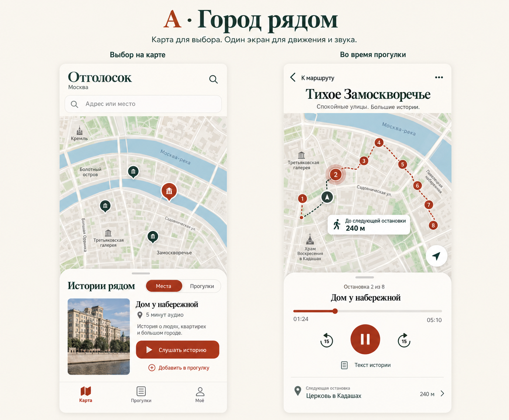
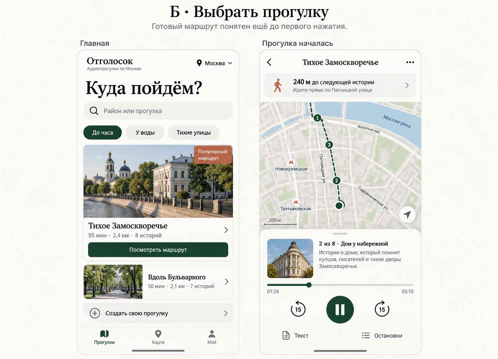
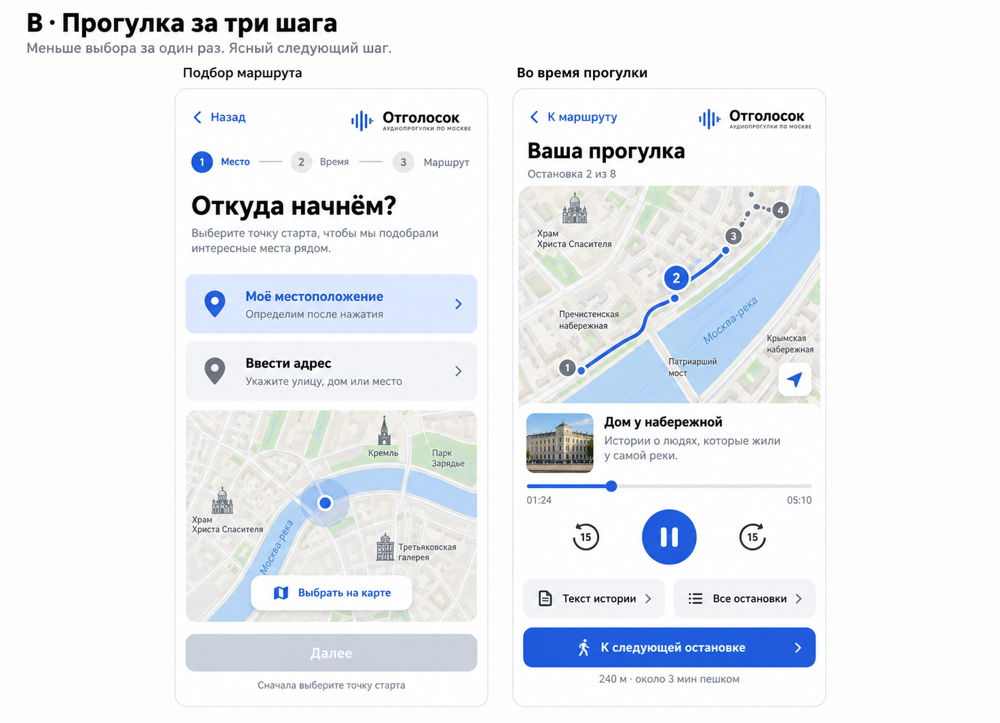

# Мобильный дизайн: обзор и три направления

Дата: 2026-10-06. Это материалы для выбора направления, не утверждённый план реализации.

## Что проверено

Production https://otgolosok.online/ открыт в браузере при 390×844. Проверены первый экран и переход «Прогулка»: открывается панель «Откуда / Куда». На первом экране видны карта, предложение включить геолокацию, уведомление об обновлении и четыре пункта навигации. Разрешение геолокации не выдавалось. Активная прогулка исследована по исходникам, полноценный полевой тест не проводился. Версия production не сверялась с HEAD.

В репозитории параллельно реализуется подборка прогулок рядом: docs/agents/plans/2026-10-06-nearby-walks-suggestion.md. При будущем редизайне сохранить её согласованные правила и проверить актуальный результат, а не создавать второй независимый механизм.

## Наблюдения и предложения

1. «Прогулка» в нижней навигации открывает действие создания, тогда как соседние пункты открывают разделы. Предлагается раздел «Прогулки» и отдельная кнопка «Создать свою».
2. «История» двусмысленна в приложении про истории города. Предлагается «Моё» с явными подразделами предыдущих прогулок, черновиков и загрузок; точный состав согласовать.
3. Первое заметное действие просит геолокацию до демонстрации полезного контента. Предлагается сначала показать доступные прогулки или истории выбранного района, а геолокацию запрашивать по действию «Рядом со мной». При отказе оставить адрес и выбор на карте.
4. В конструкторе «Куда» объединяет место назначения и длительность. Предлагается явно разделить «До места» и «На время», сохранив оба текущих режима.
5. Во время прогулки основной блок должен отвечать на три вопроса: куда идти, что сейчас звучит, как поставить на паузу. Карта и аудио используют один нижний контейнер; текст и список остановок открываются отдельно. Скрытие глобальной навигации во время активной прогулки уже есть — сохранить.
6. Это экспертные гипотезы удобства, а не результаты пользовательского исследования. Проверить на коротких сценариях с 3–5 новыми пользователями: найти прогулку, начать, поставить на паузу, продолжить и вернуться к маршруту.

## Варианты

### А — город рядом

Карта как главный экран, единая нижняя панель, разделы «Карта / Прогулки / Моё». Подходит человеку, который уже находится в городе и хочет узнать про конкретное место. Риск: новичку всё ещё нужно самому выбрать интересный объект.

### Б — выбрать прогулку

Готовые прогулки с фотографией, длительностью, расстоянием и числом историй. Карта доступна отдельной вкладкой, конструктор — отдельным действием. Рекомендуемая основа для знакомства с продуктом; использовать тёплые цвета существующего бренда. Риск: качество первого экрана зависит от реальных обложек и достаточного каталога. Не вводить неподдержанные тематические фильтры без проверки данных.

### В — прогулка за три шага

Выбор старта, параметров и проверка маршрута последовательно. Полезен как внутренний сценарий создания своей прогулки и может сочетаться с Б; нейтральная синяя палитра — отдельная визуальная альтернатива. Риск: лишние шаги для постоянного пользователя; режим «До места» тоже должен сохраниться.

## Ограничения картинок

Это концепты, сгенерированные встроенным image_gen, не снимки работающего приложения. Точные промпты: [prompts.md](design/mobile-2026-10-06/prompts.md). Названия, расстояния, фотографии и геометрия карт иллюстративные.

Не переносить артефакты генерации в продукт: дублирующий поиск в А; несогласованный порядок номеров остановок, значок «Популярный маршрут», указания движения и переключатель города в Б без подтверждённых данных; новый значок бренда в В. В production использовать существующий BrandMark, реальные данные, законные фото и атрибуцию карт. Сгенерированная карта не пригодна для навигации. Размеры, контраст и доступность нельзя подтвердить по этим изображениям.

## Критерии готовности будущей реализации

- Три понятных уровня: выбор прогулки → просмотр маршрута → активная прогулка. Возврат сохраняет выбор и прогресс; уход из активной сессии не теряет звук и состояние неожиданно.
- Одна основная кнопка на состояние; пауза всегда доступна. Чётко различать переход к следующей остановке и перемещение позиции аудио.
- Нормальное, пустое, загружающееся и ошибочное состояния для списка, маршрута и аудио. Нет геолокации, сеть пропала, аудио не готово, офлайн-копия неполна — каждое состояние имеет объяснение и доступное действие.
- Состояние формы и выбранные точки сохраняются при ошибке; ограниченные повторы только для временных сетевых ошибок. Существующие механизмы восстановления и хранения не переписывать ради внешнего вида.
- Цель проекта: зоны нажатия 44–48 CSS px, читаемый основной текст около 16 px, контраст WCAG AA, фокус не закрыт панелью. Минимум WCAG 2.2 AA для цели нажатия — 24×24 CSS px с исключениями; 44–48 px здесь более строгая продуктовая цель.
- Проверка 320, 360, 390 и 430 px, короткой высоты 600 px, landscape, safe-area, клавиатуры адреса и увеличенного текста. Видимые и доступные CTA, отсутствие горизонтального переполнения.
- Реальные iOS Safari и Android: разрешение/отказ геолокации, аудио после блокировки экрана, возобновление и офлайн. Браузерная эмуляция не заменяет устройства.
- Тесты изменённого поведения и браузерные сценарии на Chromium/WebKit, плюс ручная проверка экранным диктором. Не подтверждать готовность только успешным unit-тестом.

Источники критериев: [W3C: размер цели](https://www.w3.org/WAI/WCAG22/Understanding/target-size-minimum), [W3C: видимость фокуса](https://www.w3.org/WAI/WCAG22/Understanding/focus-not-obscured-minimum).

## Проверенные точки будущих изменений

- src/features/navigation/app-navigation.tsx: AppNavigation; «Прогулка» ссылается на /?walk=create, «История» — /history.
- src/features/explore/around-screen.tsx: AroundScreen подключает WalkCreationPanel и встроенную навигацию.
- src/features/walk-builder/walk-creation-panel.tsx: WalkCreationPanel, выбранный режим destination/time, кнопки «Откуда / Куда», варианты длительности 30/60/90 и сохранение черновика через useWalkDraft.
- src/features/tour/walk-session.tsx: WalkSession и MapShell с navigation={!active}; кнопки начала, продолжения, перехода и завершения.
- src/features/tour/tour-experience.tsx: TourExperience, состояние воспроизведения, переходы между остановками и офлайн-контролы.
- src/features/shell/sheet.tsx, map-shell.tsx, map-insets.ts: существующая основа общих панелей и карты.
- src/styles/tokens.css: существующие тёплые цвета, размеры контролов и safe-area; менять централизованно.
- e2e/navigation.spec.ts, e2e/layout-invariants.spec.ts, e2e/walk-session.spec.ts, e2e/offline-walk.spec.ts: основа будущих проверок.
- Перед изменением Next.js-кода прочитать соответствующие локальные руководства node_modules/next/dist/docs/.

## Что требуется выбрать перед планом

Главный сценарий А/Б/В и степень изменения визуального стиля. Рекомендация: главная Б, карта и активная прогулка на общей основе А, отдельный конструктор с ясной последовательностью В и сохранением режима «До места». Реализация и изменение приложения в рамках этого обзора не выполняются.
